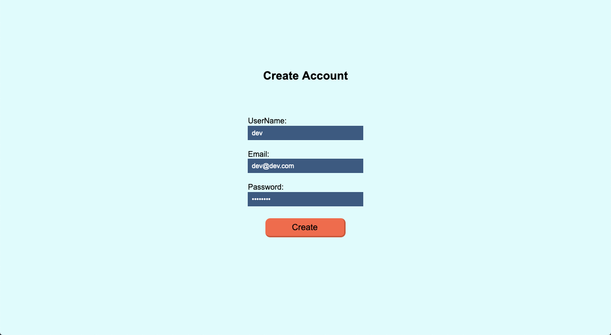
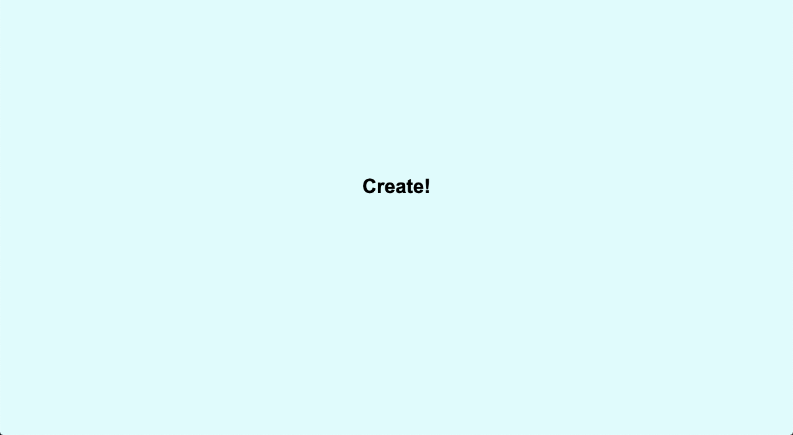
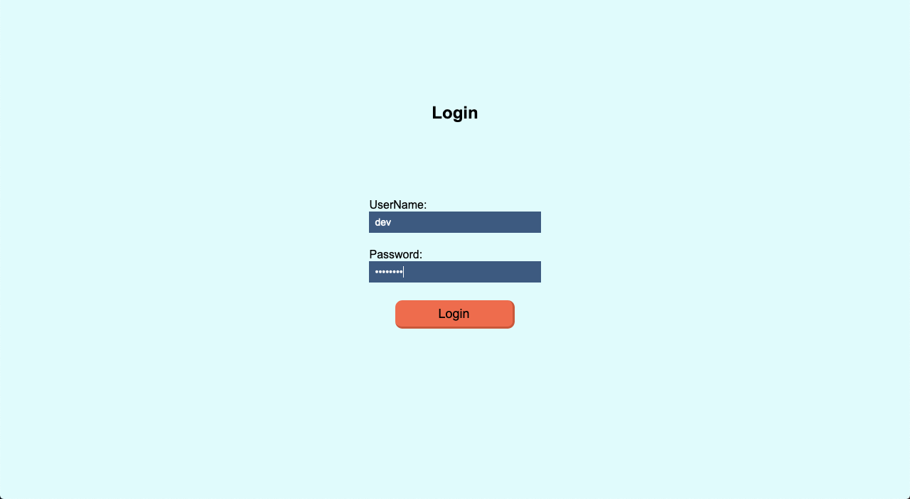

# Create account with fs (node-file-system)

- How to install:
```js
    % npm install
    % npm run start
```
> Open in your browser: _http://localhost:3333_

## Example

- Create new account


- If all of. your account created


- Login
